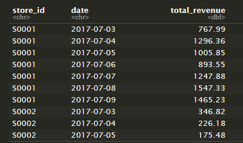
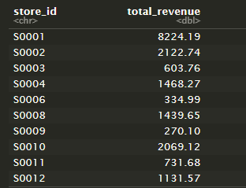

```{r setup, include=FALSE}
knitr::opts_chunk$set(echo = TRUE)
setwd("D:/Github Respositories/R-code-aut23/Report")

```


\vspace*{\fill}
By including this statement, we the authors of this work, verify that:
© Copyright: Western Sydney University, 2023. No part of this publication may be reproduced or transmitted in any form or
by any means, electronic or mechanical, including photocopying, recording, or by any information storage and retrieval system,
without the prior written permission from the Dean, School of Computer, Data and Mathematical Sciences. Copyright for acknowledged materials reproduced herein is retained by the copyright holder. All readings in this publication are copied under licence in
accordance with Part VB of the Copyright Act 1968.


*   We hold a copy of this assignment that we can produce if the original is lost or damaged.
*   We hereby certify that no part of this assignment/product has been copied from any other student’s
work or from any other source except where due acknowledgement is made in the assignment.
*   No part of this assignment/product has been written/produced for us by another person except
where such collaboration has been authorised by the subject lecturer/tutor concerned.
*   We are aware that this work may be reproduced and submitted to plagiarism detection software pro-
grams for the purpose of detecting possible plagiarism (which may retain a copy on its database
for future plagiarism checking).
*   We hereby certify that we have read and understand what the School of Computing, Engineering
and Mathematics defines as minor and substantial breaches of misconduct as outlined in the learning
guide for this unit.

\newpage

## Report Background:  
Your company, Dawson Steward Analytics, a consultancy firm specialised in AI analytics is tasked by a
retail chain in the northern hemisphere to analyse their sales data.

## Question 1:
Write the code to compute the total revenue of each store at the end of each day. Is there a noted difference between the days? Write also the code to calculate the total revenue over the seven day period. Plot the latter on a graph.  
  
  
|   To compute the question above the following code was used :  
```{r , eval=FALSE}
# Load the Library
library(dplyr)
library(ggplot2)

# Read the sales data into a data frame
sales_data <- read.csv("sales_ug.csv")

# Calculate daily total revenue by store and date
daily_revenue <- sales_data %>%
  group_by(store_id, date) %>%
  summarise(total_revenue = sum(revenue))

# Calculate total revenue for each store
total_revenue <- sales_data %>%
  group_by(store_id) %>%
  summarise(total_revenue = sum(revenue))

# Print total revenue by store and date
print(daily_revenue)

print(total_revenue)
# Plot the results
ggplot(total_revenue, aes(x=store_id, y=total_revenue, fill=store_id)) +
  geom_bar(stat="identity") +
  labs(title="Total Revenue Per Store Over Seven Days",
       x="Store ID",
       y="Total Revenue ($)") +
         theme(legend.position="none")
```  
  
  \newpage
  
### Rationale of code

* **Choice of package (dplyr and ggplot):** The use of the dplyr package is chosen because it provides efficient functions to help perform data manipulation tasks. It provides functions such as **`summarise()`**, which provides a way to combine values into single rows and **`group_by()`** which groups data depending on the variables you give it. This allows for calculations to be done on big sets of data. The use of **`ggplot2`** is due to the question asking for a plot of the weekly revenue for each store and I intend to use this package for functions that allow for an easier time to plotting the data.    

* **Reading the sales data:** To read the CSV files I have made use of the **`read.csv()`** function is used to read the data from a CSV file named **`sales_ug.csv`**. This is then stored in a data frame named **`sales_data`**, this was named sales_data as it contains all the sales data that was read from the **`sales_ug.csv`** file.  

* **Computing the daily revenue**: To compute the daily revenue for each store, I have used the **`dplyr`** package and have taken the data frame of **`sales_data`**, which was the data from the csv file and I applied the **`group_by(store_id, date)`** function. I used to function to group the data frame into groups of store id and date, in which I intend to combine as I am trying to calculate each store’s daily revenue. Then I apply the **`summarise (total_revenue = sum(revenue))`** function, with this I intend to combine the grouped variables from before and add the revenue values together into a new variable named **`total_revenue`**. The result of this is a data frame in which I combine the dates and revenue for each store.  

*   **Computing Weekly Revenue:** To calculate the weekly revenue of each store, I made use of the **`dplyr`** package, I have taken the **`sales_data`** data frame, and grouped it using the **`group_by(store_id)`**, this function groups the data frame by store id as I wanted to combine the revenue of each store over each date. Then I made use of the **`summarise(total_revenue = sum(revenue))`** function again, This line calculates the total revenue for each group. The **`summarise`** function is used to apply a summary operation, and in this case, it calculates the sum of the **`revenue`** variable for each group. The result is stored in a new variable called **`total_revenue`**.

* **Printing the daily revenue**: To print out the data frame **`daily_revenue`**, I utilised the function of **`print(daily_revenue)`**, This allows me to print out the data frame and display it for further analysis of each day.

*   **Plotting the data:** This is where I utilise **`ggplot2`** package to plot the data that I calculated from the code before. This is where I used the function **`ggplot(total_revenue, aes(x=store_id, y=total_revenue, fill=store_id))`** I decided on a bar graph (**`geom_bar(stat="identity")`**) as it provides the easiest way to compare the different stores’ revenue over the week. I made the x-axis the store ID and the y-axis the revenue as it allows for the bar graph to go up, which allows me to compare the stores’ revenue easier. I decided on removing the legend (**`theme(legend.position="none")`**) as it took up a lot of space from the plot and the x-axis is already showing each store.

|   Output of the code:
```{r, message=FALSE, echo=FALSE}
# Load the Library
library(dplyr)
library(ggplot2)

# Read the sales data into a data frame
sales_data <- read.csv("sales_ug.csv")

# Calculate daily total revenue by store and date
daily_revenue <- sales_data %>%
  group_by(store_id, date) %>%
  summarise(total_revenue = sum(revenue))

# Calculate total revenue for each store
total_revenue <- sales_data %>%
  group_by(store_id) %>%
  summarise(total_revenue = sum(revenue))

# Print total revenue by store and date
print(daily_revenue)

print(total_revenue)
# Plot the results
ggplot(total_revenue, aes(x=store_id, y=total_revenue, fill=store_id)) +
  geom_bar(stat="identity") +
  labs(title="Total Revenue Per Store Over Seven Days",
       x="Store ID",
       y="Total Revenue ($)") +
         theme(legend.position="none")

```


### Results  
To answer question 1:
  
* Usually a store tends to increase revenue over the week, but some other stores like S0006, S0009, S0011 either stay around the same or lose revenue as the week goes on.

### Code Testing  
To test this code output I have compared my outputs together to validate if I am getting the right outputs and did calculations correctly. 

Taking the output of the daily revenue at random intervals and comparing it to the weekly revenue:  \



When adding S0001 the daily revenue (8224.19) and comparing it to the weekly revenue calculated  

  

  
As we can see from the outputs the daily revenue is indeed the same as the weekly revenue.  \

\newpage

I have conducted another test to ensure validity of the results. 


  
  
Combing the revenue from S0077 (422.87) and comparing it to the weekly revenue calculated   
  
  

  
  
We can see that the daily revenue added does add up to the weekly revenue calculated.   

This means that the code is valid in calculating daily and weekly revenue for each store

\newpage

## Question 2:  
What’s the most popular product type (hierarchy 1) sold in all stores over a week? How much
revenue did the stores receive for that product during the week? How does that compare with the
second most popular product? Provide a table that shows the product type ranked from most to
least popular. For each product type provide: how many subtypes (hierarchy 2) are there, how
many products are in this product type, what’s the sales quantity, and the revenue generated.  
  
To answer this question I used the code below:

```{r, eval=FALSE} 
#Load Library
library(dplyr)

# Load the CSVs files into data frames
sales_data <- read.csv("sales_ug.csv")
product_hierarchy <- read.csv("product_hierarchy.csv")

# Merge the sales and product hierarchy data frames using product id
merged_data <- merge(sales_data, product_hierarchy, by = "product_id")

# Calculate total sales quantity and revenue for each product type
product_type_summary <- merged_data %>%
  group_by(hierarchy1_id) %>%
  summarise(
    Subtypes = n_distinct(hierarchy2_id),
      Products = n_distinct(product_id),
        Sales_Quantity = sum(sales),
          Revenue = sum(revenue)
            ) %>%
              arrange(desc(Sales_Quantity))

# Display the product type summary table
print(product_type_summary)

```  
  
Which outputs the following:  

```{r echo=FALSE, message=FALSE}
#Load Library
library(dplyr)

# Load the CSVs files into data frames
sales_data <- read.csv("sales_ug.csv")
product_hierarchy <- read.csv("product_hierarchy.csv")

# Merge the sales and product hierarchy data frames using product id
merged_data <- merge(sales_data, product_hierarchy, by = "product_id")

# Calculate total sales quantity and revenue for each product type
product_type_summary <- merged_data %>%
  group_by(hierarchy1_id) %>%
  summarise(
    Subtypes = n_distinct(hierarchy2_id),
      Products = n_distinct(product_id),
        Sales_Quantity = sum(sales),
          Revenue = sum(revenue)
            ) %>%
              arrange(desc(Sales_Quantity))

# Display the product type summary table
print(product_type_summary)

```
  
### Rationale of code  

* **Choice of package (dplyr)**: The **`dplyr`** package is chosen again because it provides efficient functions to help perform data manipulation tasks. It also offers functions that allow the code to express data transformation steps in a clear and readable manner. In this  **`summarise()`** is used.  

* **Reading the Data:** I utilize the **`read.csv()`** function yet again in which I read the **`sales_ug.csv`** into the **`sales_data`** data frame and the **`product_hierarchy.csv`** into the **`product_hierarchy`** data frame. This will allow me to manipulate the data further later.

* **Merging the Datasets:** The **`merge()`** function is used to combine the **`sales_ug.csv`** and **`product_hierarchy.csv`** data sets based on the common id of **`product_id`**. This allows me to join the relevant information from both data sets into a single data frame to allow for calculations and other   

* **Calculating Total Sales Quantity and Revenue:** I take the merged data from previous code as it has all the information needed. I then use the **`group_by(heirarchy1_id)`** function as it groups the data depending on Hierarchy 1 id as I am trying to find the most popular product type from hierarchy 1 as the question has asked.  I use the **`summarise()`** function again as it allows me to combine the multiple ids into one during calculations. The I use the function of **`Subtypes = n_distinct(hierarchy2_id)`** as the question asks for the number of subtypes for each hierarchy 1 id and n_distinct counts the amount of unique hierarchy 2 IDs from each hierarchy 1. Again, this function is used to count the number of product IDs as I want to find how many products are within each hierarchy as the question asks for this. I then calculate the revenue of each hierarchy through the function of **`revenue = sum(revenue)`** this will add the revenue of each hierarchy 1 id, allowing me to find the total revenue for each id. Then I have utilized the **`arrange(desc(sales_quantity))`** function to arrange the output in a descending order as the question has asked to rank them from the most popular to least and the descending order of sales quantity required. All of this is then placed into the product_type_summary data frame

* **Displaying the Product Type Summary Table:** Yet again I make use of the **`print()`** function and print the **`product_type_summary`** calculated from the previous code, This will allow me to analyze the results from the calculations
  
### Results:
To answer question 2:

* The most popular product type was H00.  

* Over the week H00 has made 100165 

* The second most popular product type is H01 which has made 61773 in revenue 

* HOO has 5 subtypes, there are 128 products, 40257 sales have been made and it has made 100165 in revenue. H01 has 4 subtypes, it contains 99 products, it has made 5797 sale quantity and 61773 in revenue. H02 has 2 subtypes, 2 products, made 1142 sales and have made 12221 in revenue. Finally, H03 has 7 subtypes, 119 products, has 4266 sales and has made 25378 in sales.

### Code Testing  
To test this code I compared it to the CSV files which was loaded in from the code. In the CSV files under the hierarchy1_id there is 4 different types of ids, which match the output of the code.  


  
Also looking through the CSV files we can compare values of the subtypes and the calculations done. Looking throught the subtypes of H02 I can confirm that the subtypes calculations is correct. With the sales quantity I had to use Microsoft Excel that easily allowed me to confirm sales quantity, which indeed was accurate Same goes for the revenue calculations

\newpage

## Question 3:  
Compare the sales volumes between the two most common store types in the data set. How do they compare in terms of total revenue? Is there a relationship between a store’s size and its revenue?  

To answer the question above the following code was used:

```{r, eval=FALSE}
# Load required library
library(dplyr)

# Load the data into data frames
sales_data <- read.csv("sales_ug.csv")
store_cities <- read.csv("store_cities.csv")

# Merge the data frame using store_id
merged_data <- merge(sales_data, store_cities, by="store_id") 

# Calculate the most common store types and arrange in descending order
most_common_storetypes <- merged_data %>%
  count(storetype_id) %>%
    arrange(desc(n))

# Calculate sales volume for store types and arrange in descending order
sales_volume <- merged_data %>%
  group_by(storetype_id) %>%
    summarise(total_sales = sum(sales)) %>%
      arrange(desc(total_sales))

# Calculate the total revenue for each store type and arrange in descending order
revenue <- merged_data %>%
  group_by(storetype_id) %>%
    summarise(total_revenue = sum(revenue)) %>% 
      arrange(desc(total_revenue))

# Calculate store size and how much revenue its made
store_size_revenue <- merged_data %>%
  group_by(store_size) %>%
    summarise(revenue = sum(revenue))

# Print out the revenue for each store type
print(most_common_storetypes)

print(sales_volume)

print(revenue)

# Plot the store size with revenue data frame
ggplot(store_size_revenue, aes(x=store_size, y=revenue, fill=store_size)) +
  geom_bar(stat="identity") +
  labs(title="Revenue depending on store size",
       x="Store Size",
       y="Total Revenue ($)") +
    theme(legend.position="none")

```
  
### Rationale of code  
  
|   For most common store types and revenue  

* **Choice of package (dplyr)**: Again The **`dplyr`** package is chosen again because it provides efficient functions to help perform data manipulation tasks. It also offers functions that allow the code to express data transformation steps in a clear and readable manner. In this  **`summarise()`**, **`count`**, **`arrange`**, **`group_by`** is used.  

* **Reading the Data:** I used the **`read.csv()`** function again to read the **`sales_ug.csv`** the **`sales_data`** and **`store_cities.csv`** into **`store_cities`** data frames

* **Merging the data frames:** Using the **`merge()`** function, I merge the **`sales`** data frame with the **`store_cities`** data frame using the common column of **`store_id`** . This allowed me to join the data frame to be together in one data frame named merged_data.

* **Calculating most common store type:** Here I used the **`count()`** function from the dplyr package to count the unique values of the store types and add them together to allow me to find the most common store type and used the **`arrange()`** function to place the counted values into a descending list allowing me to find the most common store types as the top 2 values will be at the top of the data frame. This is all then put into the **`most_common_storetypes`** data frame for further analysis later.

* **Calculating sales volume:** Here I take the **`merged_data`** data frame a apply the **`group_by(storetype_id)`** function as it groups the data by store type for further calculations. Then I use the **`summarise(total_sales = sum(sales))`** to apply the sum function on the sales column for each thing grouped by **`group_by()`**, resulting in a data frame that contains each store type and the number of sales they each have, This will allow me to compare the sales volume between the 2 most common store types as the question requires. Then these calculations have been stored within the **`sales_volume`** data frame.

* **Calculating total revenue:** For calculating total revenue, again I take the merged data frame and apply the **~group_by(storetype_id)`** function, this will allow me to group the data by store type to calculate for each store type. Using the **`summarise(total_revenue = sum(revenue))`** function from the dplyr again but this time I have used the revenue column, which allows me to calculate the total revenue each store has made. This all goes into a data frame called **`revenue`**  

* **Calculating Revenue based on store size:** : I take the data frame of the merged csv files and group the data frame with the function **`group_by(store_size)`** this groups the data frame by the store size numbers and allows for calculations to be done for each store size. The **`summarise()`** function is then applied to each group within the group to combine each store size into one, in which I then calculate the **`sum()`** of the revenue for each store type. This all results in a data frame in which all the store types are listed with the revenue they made on the side

* **Printing calculations:** The **`print()`** function is used again to print out the resulting data frames calculated from before. I have printed the **`most_common_storetypes`**, **`sales_volume`** and the **`revenue`** data frames, This allows me to further analyse the data frames produced by the calculations. 

* **Plotting the data:** Here I utilized the **`ggplot2`** package and plot the data frame so it will be easier to analyse. I have made the x-axis the store ID and the y-axis the total revenue as it allows for the bars to go in an upwards direction, which helps me determine if there was a relationship between the store size and the revenue it made. This plot would grant me the means of determining if a relationship has formed.

### Results  
The output of the comparing the sales between the two most common store types 

```{r echo=FALSE, message=FALSE}
# Load required library
library(dplyr)

# Load the data into data frames
sales_data <- read.csv("sales_ug.csv")
store_cities <- read.csv("store_cities.csv")

# Merge the data frame using store_id
merged_data <- merge(sales_data, store_cities, by="store_id") 

# Calculate the most common store types and arrange in descending order
most_common_storetypes <- store_cities %>%
  count(storetype_id) %>%
    arrange(desc(n))

# Calculate sales volume for store types and arrange in descending order
sales_volume <- merged_data %>%
  group_by(storetype_id) %>%
    summarise(total_sales = sum(sales)) %>%
      arrange(desc(total_sales))

# Calculate the total revenue for each store type and arrange in descending order
revenue <- merged_data %>%
  group_by(storetype_id) %>%
    summarise(total_revenue = sum(revenue)) %>% 
      arrange(desc(total_revenue))

# Calculate store size and how much revenue its made
store_size_revenue <- merged_data %>%
  group_by(store_size) %>%
    summarise(revenue = sum(revenue))

# Print out the revenue for each store type
print(most_common_storetypes)

print(sales_volume)

print(revenue)

# Plot the store size with revenue data frame
ggplot(store_size_revenue, aes(x=store_size, y=revenue, fill=store_size)) +
  geom_bar(stat="identity") +
  labs(title="Revenue depending on store size",
       x="Store Size",
       y="Total Revenue ($)") +
    theme(legend.position="none")
```  

|   You can see that the the two most common stores are ST04(35567 sales, 144629 in revenue) and ST03(7980 sales, 21777 in revenue). Calculating the difference in revenue when comparing ST04 and ST03 is a difference of around 122852 in revenue.

|   By looking at the plot we can see that up to store size 41 there is a loose positively sloping line between store size and revenue until it reaches around store size 41, in which then the graphs proceeds to slope down until the revenue is lower. This indicates that to a certain extent store size does indeed affect revenue but too big of a store size can heavily affect revenue.  
 
### Code Testing  
To test this code section, I had to use Microsoft Excel again, It allowed to me count the amount of store type IDs that the CSV files had, which confirmed the amount of store type IDs calculated. The same goes for the total_sales, I have sorted the CSV file and have calculated the total sales for each store type, For ST02 I have calculated 1589.80 with hand calculations which is close to what the code calculated (1589.804). I have used Hand calculations yet again for revenue, I had calculated 10086.08 and the code calculated the same.

## Question 4:
Several different types of promotions were applied to the products during the period with various
level of promotion rates. For each promotion type, display the different levels of promotion used
during the period. Analyse the effectiveness of the promotion on the sales of the products.  

The following code was used to analyse the effectiveness of promotions:  

``` {r eval=FALSE}
# Load required library
library(dplyr)

# Load the sales data in a data frame
sales_data <- read.csv("sales_ug.csv")

# Calculate sales for each combination of promo type and bin
promo_sales <- sales_data %>%
  group_by(promo_type_1, promo_bin_1) %>%
  summarize(total_sales = sum(sales))

print(promo_sales)

```

### Rationale of code

* **Choice of package (dplyr):** Again, I have decided to use the **`dplyr`** package again as it is very helpful in data manipulation and calculations. I have the used **`summarise`** and **`group_by`** functions again. 

* **Reading the data:** I have read the data with the **`read.csv("sales_ug.csv")`**, this function allows me to obtain the data and place it into a data frame named **`sales_data`** for further calculations.

* **Calculating the different levels of promotion:** Here I used the **`sales_data`** from the data frame made out of the CSV file and have grouped (**`group_by(promo_type_1, promo_bin_1)` from the dplyr package**) the data by **`promo_type_1`** and **`promo_bin_1`** this would allow me to calculate the total sales for different combinations of promotion types and rates. Then I used the **`summarise()`** function from the dplyr package again to calculate the sales from each promotion.  The **`total_sales = sum(sales)`** creates a new column for total sales and sums the sales of each promotion combination made by the **`group_by`** function before. This will allow me to see each promotion type, its binned promotion rate, and the sales of each promo type. The result of the summarization, which includes the total sales for different combinations of promotion types and rates, is stored in a data frame named **`promo_sales`**.

* **Printing the data:** Again I have used the **`print()`** function to print out the data frame **`promo_sales`**, this enables me to read the calculations and form results.

### Results

``` {r echo=FALSE, message=FALSE}
# Load required library
library(dplyr)

# Load the sales data
sales_data <- read.csv("sales_ug.csv")

# Analyze the effectiveness of promotions on sales
promo_sales <- sales_data %>%
  group_by(promo_type_1, promo_bin_1) %>%
  summarize(total_sales = sum(sales))

print(promo_sales)

```

From the results of the code we can see that the usually very low promo bin type provides the most sales (assuming that PR14 is not an actual promo since there is no bin value) and promo type PR12 has the most total sales for its specific promo type.

### Code testing  
To test this code I have looked towards the csv file for validation. Referring to the CSV file sorting the promo_type_1 in descending order, we can see the different types of promo_bin_1 for each promo type.  


  
Comparing the CSV to the results it is accurate in the combinations it has calculated.  

\newpage

# References  

* CRAN. (2023, NA NA). Introduction to dplyr. Retrieved from Introduction to dplyr: https://cran.r-project.org/web/packages/dplyr/vignettes/dplyr.html  

* Holtz, Y. (2023, NA NA). Data visualization with R and ggplot2. Retrieved from ggplot2: https://r-graph-gallery.com/ggplot2-package.html  

* RDocumentation. (2023, NA NA). Home - RDocumentation. Retrieved from RDocumentation: https://www.rdocumentation.org/